# POS System

Bu proje, restoran, kafe ve benzeri işletmeler için geliştirilmiş, mobil (Flutter) ve backend (Node.js/TypeScript) kısımlarından oluşan kapsamlı bir POS (Nokta Satış) sistemidir.

## 🌟 Özellikler (Features)

- 👥 **Rol Bazlı Yetkilendirme:** Patron, Müdür, Garson ve Mutfak olmak üzere 4 farklı yetki seviyesi ve PIN ile hızlı giriş.
- 🪑 **Masa & Rezervasyon Yönetimi:** Masaların anlık durum takibi, sipariş atama ve ileri tarihli rezervasyon oluşturma.
- 🍔 **Gelişmiş Menü Yönetimi:** Ürün, kategori ekleme, fiyatlandırma ve ürün detaylı düzenleme işlemleri.
- 📡 **Gerçek Zamanlı İletişim (Real-time):** Garsonun girdiği siparişin anında mutfak ve kasaya (Socket.io) iletilmesi.
- 💰 **Kasa & Maliyet Yönetimi:** Gelir-gider takibi, personel maaşları ve detaylı maliyet hesaplamaları.
- 📊 **Gelişmiş Raporlar:** Görsel grafikler (fl_chart) ile günlük ve aylık satış raporlarının analizi.
- 📝 **Log ve İşlem Geçmişi:** Sistemde yapılan tüm önemli işlemlerin (iptal, iade, satış) kayıt altına alınması.
- 👨‍💼 **Personel Yönetimi:** Çalışanların vardiya, yetki ve kişisel bilgilerinin (özlük) takibi.

## 🛠️ Kullanılan Teknolojiler (Tech Stack)

### Mobil Uygulama (Frontend)
- **Framework:** Flutter
- **State Management:** Riverpod
- **Ağ İstekleri & Realtime:** Dio, Socket.io Client
- **Routing:** GoRouter
- **Grafikler & UI:** fl_chart, Google Fonts, Reorderable Grid View

### Sunucu (Backend)
- **Çalışma Ortamı:** Node.js & TypeScript
- **Framework:** Express.js
- **Veritabanı ORM:** Prisma
- **Gerçek Zamanlı İletişim:** Socket.io
- **Güvenlik:** JWT (JSON Web Token), Bcrypt

---

## 🚀 Canlı Demo (Live Demo)

Projeyi bilgisayarınıza kurmadan denemek için aşağıdaki bağlantıları kullanabilirsiniz:

- **Web Canlı Demo (Tarayıcıda Çalıştır):** [Uygulamayı Tarayıcıda Test Et](https://appetize.io/app/b_2ywfkzjhpphsetxycfjwfn3wzu)
- **Backend API URL:** `https://pos-system-nd0u.onrender.com`

---

## 🔑 Test Hesapları (Test Accounts)

Uygulamayı test edebilmeniz için örnek kullanıcı giriş bilgileri:

- 👑 **Patron (Admin) PIN:** `1111`
- 💼 **Müdür PIN:** `2222`
- 🤵 **Garson PIN:** `3333`
- 🍳 **Mutfak PIN:** `4444`

---

## 📦 Kurulum Dosyaları (APK & IPA)

Projeyi doğrudan kendi cihazınızda denemek isterseniz, derlenmiş dosyaları aşağıdaki bağlantılardan indirebilirsiniz:

- 📱 [Android APK İndir](https://github.com/affanccn/pos-system/releases/latest/download/ArtisanPOS.apk)
- 🍏 [iOS IPA İndir](https://github.com/affanccn/pos-system/releases/latest/download/app-unsigned.ipa)

*(Not: iOS uygulamasını yüklemek için TestFlight veya bir Apple Developer hesabına ihtiyacınız olabilir.)*

---

## 🛠️ Yerel Geliştirme (Local Development)

Projeyi kendi bilgisayarınızda çalıştırmak için:

### 1. Backend Kurulumu
```bash
cd backend
npm install
npm run start:dev
```

### 2. Mobil Uygulama Kurulumu (Flutter)
```bash
cd pos_mobile
flutter pub get
flutter run
```

## 📸 Ekran Görüntüleri

Aşağıda uygulamanın çeşitli modüllerine ait ekran görüntülerini bulabilirsiniz:

<table>
  <tr>
    <td align="center">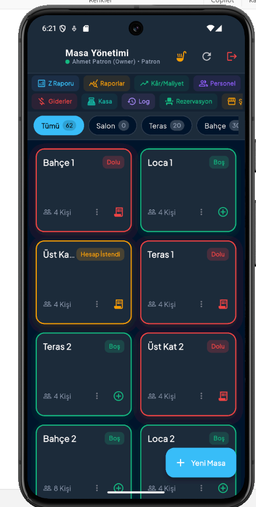<br><b>Masa Yönetimi</b></td>
    <td align="center">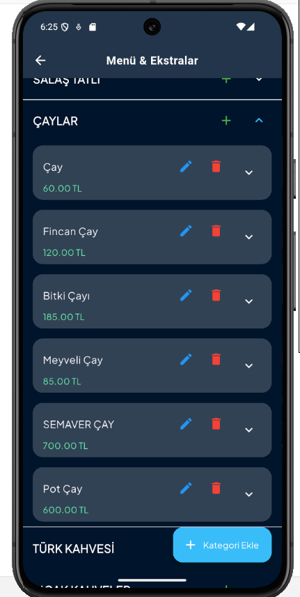<br><b>Menü Yönetimi</b></td>
    <td align="center">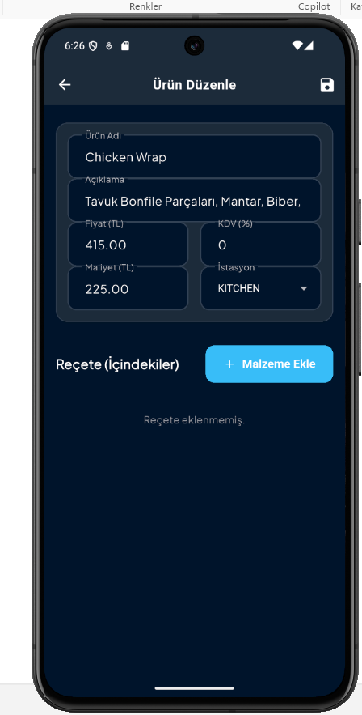<br><b>Ürün Düzenleme</b></td>
  </tr>
  <tr>
    <td align="center">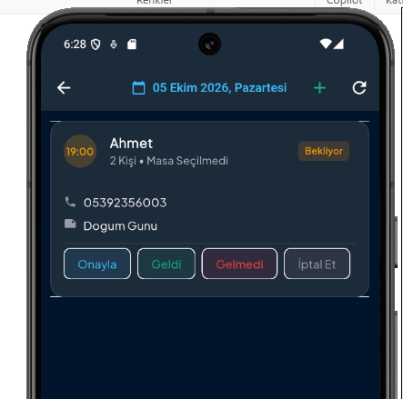<br><b>Rezervasyon Ekranı</b></td>
    <td align="center">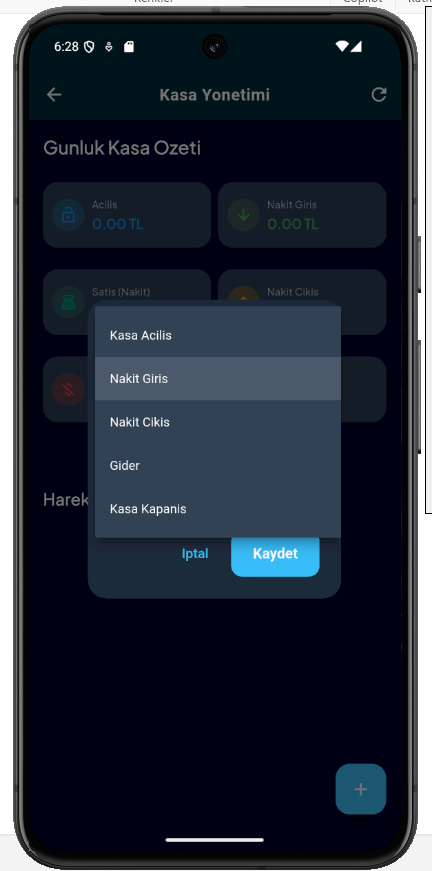<br><b>Kasa Yönetimi</b></td>
    <td align="center">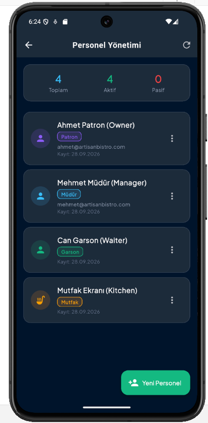<br><b>Personel Yönetimi</b></td>
  </tr>
  <tr>
    <td align="center">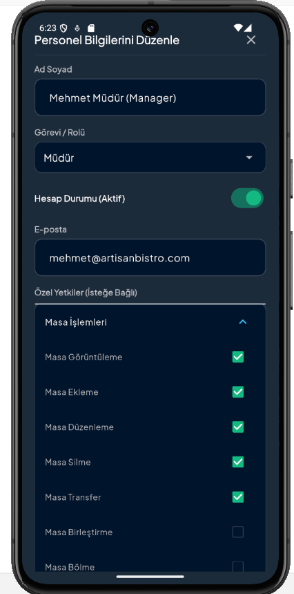<br><b>Personel Bilgileri</b></td>
    <td align="center">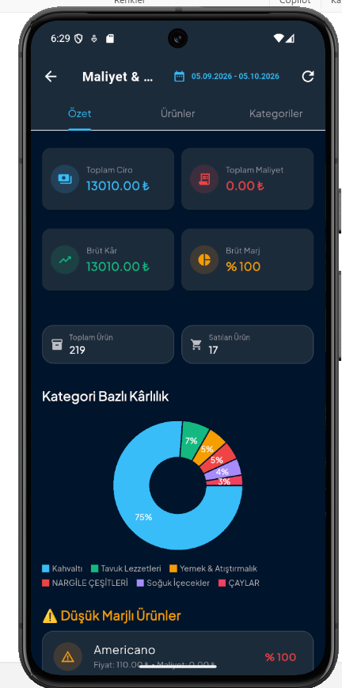<br><b>Maliyet (1)</b></td>
    <td align="center">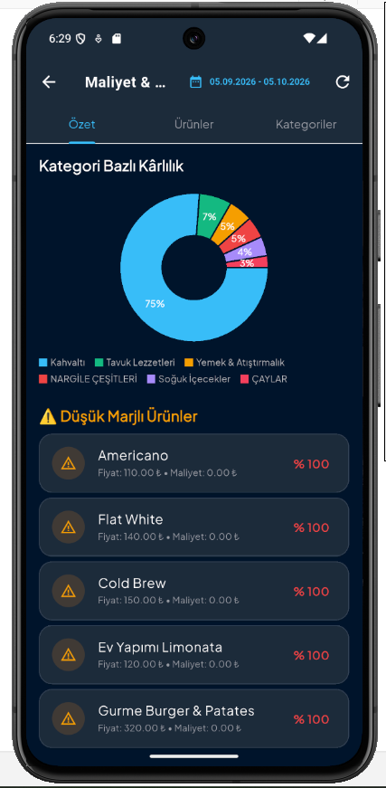<br><b>Maliyet (2)</b></td>
  </tr>
  <tr>
    <td align="center">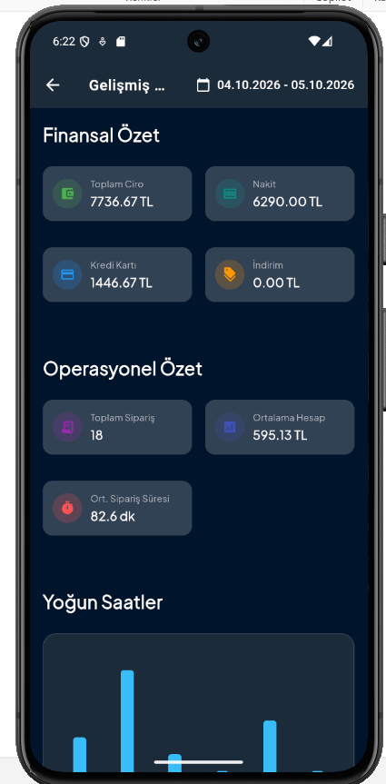<br><b>Gelişmiş Raporlar (1)</b></td>
    <td align="center">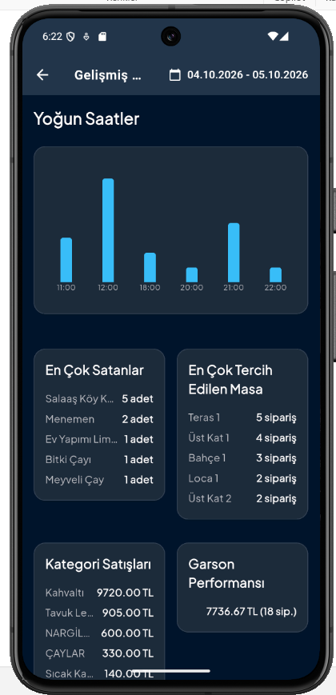<br><b>Gelişmiş Raporlar (2)</b></td>
    <td align="center">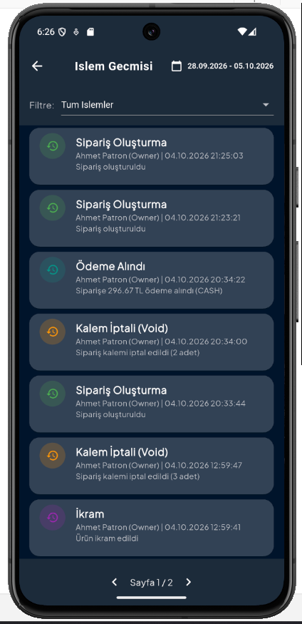<br><b>Log ve İşlem Geçmişi</b></td>
  </tr>
</table>
